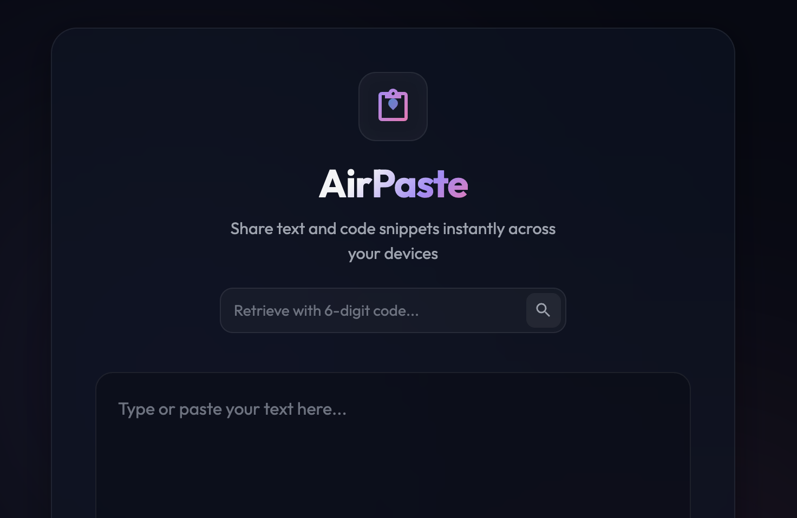

# AirPaste

AirPaste is a cross-platform clipboard manager that allows you to copy and paste text between devices 
seamlessly. 

You can find the application running here:
https://air-paste.guildenstern70.deno.net/

This application is built using Deno, a secure runtime for TypeScript, and leverages Upstash Redis
for the persistence of clipboard data.

## Setup

You should have Deno installed on your machine. If you don't have it yet, you can install it 
by following the instructions on the [Deno website](https://deno.land/#installation).

You should also have a working Upstash Redis instance. You can create a free account and set 
up a Redis database at [Upstash](https://upstash.com/).

Then, add the relevant keys to your environment variables. You can do this by creating a `.env` file 
in the root of the project with the following content:

    UPSTASH_DB_HOTS=rediss://**********:6379
    UPSTASH_DB_URL=https://********.upstash.io
    UPSTASH_REDIS_TOKEN=**************
    UPSTASH_REDIS_READONLY_TOKEN=**************

## Run

To run AirPaste type

    ./run.sh

## Test

To run tests, type

    deno test --allow-net

## Lint

